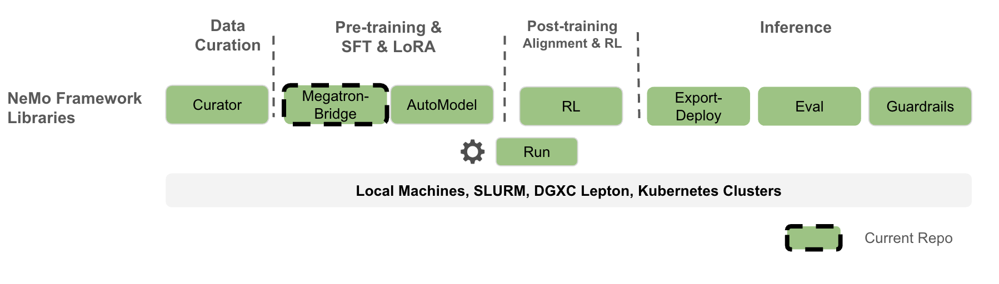

<div align="center">

# Megatron Bridge

[](https://codecov.io/github/NVIDIA-NeMo/Megatron-Bridge)
[](https://github.com/NVIDIA-NeMo/Megatron-Bridge/actions/workflows/cicd-main.yml)
[](https://www.python.org/downloads/release/python-3100/)
[](https://github.com/NVIDIA-NeMo/Megatron-Bridge/stargazers/)

[Documentation](https://docs.nvidia.com/nemo/megatron-bridge/latest/) | [Supported Models](#supported-models) | [Examples](https://github.com/NVIDIA-NeMo/Megatron-Bridge/tree/main/examples) | [Contributing](https://github.com/NVIDIA-NeMo/Megatron-Bridge/blob/main/CONTRIBUTING.md)
</div>

## Overview

NeMo Megatron Bridge is a PyTorch-native library within the [NeMo Framework](https://github.com/NVIDIA-NeMo) that serves as a powerful **bridge, conversion, and verification layer** between 🤗 Hugging Face and [Megatron Core](https://github.com/NVIDIA/Megatron-LM/tree/main/megatron/core). It provides bidirectional checkpoint conversion between these formats, enabling other projects to leverage Megatron Core's parallelism capabilities or export models for various inference engines. The bridge includes built-in verification mechanisms to ensure conversion accuracy and checkpoint integrity across different model formats.

On top of the bridge, NeMo Megatron Bridge provides a performant and scalable PyTorch-native training loop that leverages [Megatron Core](https://github.com/NVIDIA/Megatron-LM/tree/main/megatron/core) to deliver state-of-the-art training throughput. It supports pretraining and fine-tuning with features like tensor and pipeline parallelism, and mixed precision (FP8, BF16, FP4, etc.). Users can either use existing 🤗 Hugging Face models or define custom PyTorch model definitions for flexible end-to-end workflows.

NeMo Megatron Bridge is a refactor of the [previous NeMo](https://github.com/NVIDIA/NeMo) training stack that adopts a PyTorch-native training loop to provide greater flexibility and customizability for developers.



## 🔧 Installation

### 🐳 NeMo Framework container

The best experience, highest performance, and full feature support are provided by the [NeMo Framework container](https://catalog.ngc.nvidia.com/orgs/nvidia/containers/nemo/tags). Fetch the most recent $TAG and run the following to start a container:

```bash
docker run --rm -it -w /workdir -v $(pwd):/workdir \
  --entrypoint bash \
  --gpus all \
  nvcr.io/nvidia/nemo:${TAG}
```

### 📦 Bare-metal installation with Transformer Engine

Transformer Engine is a required dependency for Megatron Bridge. To install on bare metal (without a container), the following system requirements must be met:

- Python >= 3.10
- PyTorch >= 2.7
- CUDA >= 12.8
- cuDNN >= 9.3

We recommend installing the same versions that are present in the latest NGC PyTorch containers. The versions of these components for each container release are listed in the [PyTorch](https://docs.nvidia.com/deeplearning/frameworks/pytorch-release-notes/index.html) and [CUDA](https://docs.nvidia.com/deeplearning/frameworks/cuda-dl-release-notes/index.html) container release notes.

Please see the [instructions](https://developer.nvidia.com/cudnn-downloads) for installing cuDNN for your target platform. You can check if the CUDA toolkit and cuDNN are installed with:

```bash
dpkg -l | grep 'cuda-toolkit'
dpkg -l | grep 'cudnn.*cuda'
```

Then install Megatron Bridge:

```bash
pip install torch setuptools pybind11 wheel_stub  # Required for TE
pip install --no-build-isolation megatron-bridge
```

### Using uv

```bash
uv pip install torch --torch-backend=auto
uv pip install --no-build-isolation transformer_engine[pytorch]
uv pip install megatron-bridge
```

For development installation and additional details, please refer to our [Contribution guide](https://github.com/NVIDIA-NeMo/Megatron-Bridge/blob/main/CONTRIBUTING.md).


## ⚡ Quickstart

To get started, install Megatron Bridge or download a NeMo Framework container as described [above](#-installation).

Log in to Hugging Face Hub:
```sh
huggingface-cli login --token <your token>
```

Conversion-only quickstart (✅ Core):
```python
from megatron.bridge import AutoBridge

# 1) Create a bridge from a Hugging Face model (hub or local path)
bridge = AutoBridge.from_hf_pretrained("meta-llama/Llama-3.2-1B", trust_remote_code=True)

# 2) Get a Megatron provider and configure parallelism before instantiation
provider = bridge.to_megatron_provider()
provider.tensor_model_parallel_size = 1
provider.pipeline_model_parallel_size = 1
provider.finalize()
# 3) Materialize Megatron Core model(s)
model = provider.provide_distributed_model(wrap_with_ddp=False)

# 4a) Export Megatron → Hugging Face (full HF folder with config/tokenizer/weights)
bridge.save_hf_pretrained(model, "./hf_exports/llama32_1b")

# 4b) Or stream only weights (Megatron → HF)
for name, weight in bridge.export_hf_weights(model, cpu=True):
    print(name, tuple(weight.shape))
```

Training quickstart:
```python
from megatron.bridge import AutoBridge

import megatron.bridge.recipes.llama.llama32_1b as llama32_1b
from megatron.bridge.training.gpt_step import forward_step
from megatron.bridge.training.pretrain import pretrain

if __name__ == "__main__":
    # Load Llama from Hugging Face Hub and convert to Megatron
    bridge = AutoBridge.from_hf_pretrained("meta-llama/Llama-3.2-1B")
    model_provider = bridge.to_megatron_provider()

    # Get defaults for other configuration from an existing Llama 3.2 recipe
    cfg = llama32_1b.pretrain_config()
    cfg.model = model_provider
    cfg.train.train_iters = 10

    cfg.dataset.seq_length = cfg.model.seq_length
    cfg.tokenizer.vocab_size = cfg.model.vocab_size

    pretrain(cfg, forward_step)
```

You can launch the above script with:
```sh
torchrun --nproc-per-node=<num devices> /path/to/script.py
```

More examples:

- [Conversion scripts overview](https://github.com/NVIDIA-NeMo/Megatron-Bridge/blob/main/examples/conversion/README.md)
- [Import/Export checkpoints](https://github.com/NVIDIA-NeMo/Megatron-Bridge/blob/main/examples/conversion/convert_checkpoints.py)
- [Generation with bridge](https://github.com/NVIDIA-NeMo/Megatron-Bridge/blob/main/examples/conversion/hf_to_megatron_generate_text.py)
- [Multi-GPU loading from HF](https://github.com/NVIDIA-NeMo/Megatron-Bridge/blob/main/examples/conversion/hf_megatron_roundtrip_multi_gpu.py)
- [Compare HF vs Megatron outputs](https://github.com/NVIDIA-NeMo/Megatron-Bridge/blob/main/examples/conversion/compare_models.py)

For a deeper dive into conversion design and advanced usage, see the [models README](https://github.com/NVIDIA-NeMo/Megatron-Bridge/blob/main/src/megatron/bridge/models/README.md).

## 🚀 Key Features

- **Bridge with 🤗 Hugging Face**: Seamless bidirectional conversion between 🤗 Hugging Face and Megatron formats for interoperability ([model bridges](https://github.com/NVIDIA-NeMo/Megatron-Bridge/tree/main/src/megatron/bridge/models), [auto bridge](https://github.com/NVIDIA-NeMo/Megatron-Bridge/blob/main/src/megatron/bridge/models/conversion/auto_bridge.py), [conversion examples](https://github.com/NVIDIA-NeMo/Megatron-Bridge/tree/main/examples/conversion))
  - Online import/export without intermediate full checkpoints
  - Parallelism-aware (TP/PP/VPP/CP/EP/ETP) during conversion
  - Memory-efficient per-parameter streaming
  - Simple high-level `AutoBridge` API with architecture auto-detection
  - Optimized paths when Transformer Engine is available
- **Flexible to Customize**: Lightweight custom training loop making it easy to configure custom logic in data loading, distributed training, checkpointing, evaluation and logging ([training framework](https://github.com/NVIDIA-NeMo/Megatron-Bridge/tree/main/src/megatron/bridge/training), [training utilities](https://github.com/NVIDIA-NeMo/Megatron-Bridge/tree/main/src/megatron/bridge/training/utils))
- **Supervised & Parameter-Efficient Finetuning**: SFT & PEFT implementation tailored for Megatron-based models that supports LoRA, DoRA, and user-defined PEFT methods ([PEFT implementations](https://github.com/NVIDIA-NeMo/Megatron-Bridge/tree/main/src/megatron/bridge/peft), [finetune module](https://github.com/NVIDIA-NeMo/Megatron-Bridge/blob/main/src/megatron/bridge/training/finetune.py), [SFT dataset](https://github.com/NVIDIA-NeMo/Megatron-Bridge/blob/main/src/megatron/bridge/data/datasets/sft.py))
- **SOTA Training Recipes**: Pre-configured production-ready training recipes for popular models like Llama 3, with optimized hyperparameters and distributed training configuration ([Llama recipes](https://github.com/NVIDIA-NeMo/Megatron-Bridge/tree/main/src/megatron/bridge/recipes/llama), [recipe examples](https://github.com/NVIDIA-NeMo/Megatron-Bridge/tree/main/examples/recipes))
- **Performance Optimization**: Built-in support for FP8 training, model parallelism, and memory-efficient techniques to offer high utilization and near-linear scalability to thousands of nodes. ([mixed precision](https://github.com/NVIDIA-NeMo/Megatron-Bridge/blob/main/src/megatron/bridge/training/mixed_precision.py), [communication overlap](https://github.com/NVIDIA-NeMo/Megatron-Bridge/blob/main/src/megatron/bridge/training/comm_overlap.py), [optimizer utilities](https://github.com/NVIDIA-NeMo/Megatron-Bridge/blob/main/src/megatron/bridge/recipes/utils/optimizer_utils.py))

## Supported Models

Megatron Bridge provides out-of-the-box bridges and training recipes for a wide range of models, built on top of base model architectures from [Megatron Core](https://github.com/NVIDIA/Megatron-LM/tree/main/megatron/core). Refer to the [models directory](https://github.com/NVIDIA-NeMo/Megatron-Bridge/tree/main/src/megatron/bridge/models) for the most up-to-date list of model bridges.

### Supported Models Overview

| Model | Bridge Conversion | Pretrain Recipes | SFT & LoRA Recipes |
|-------|-------------------|-------------------|-------------------|
| [Llama 3](https://github.com/NVIDIA-NeMo/Megatron-Bridge/tree/main/src/megatron/bridge/models/llama) | ✅ | ✅ ([8b](https://github.com/NVIDIA-NeMo/Megatron-Bridge/blob/main/src/megatron/bridge/recipes/llama/llama3_8b.py), [70b](https://github.com/NVIDIA-NeMo/Megatron-Bridge/blob/main/src/megatron/bridge/recipes/llama/llama3_70b.py)) | Coming soon |
| [Llama 3.1](https://github.com/NVIDIA-NeMo/Megatron-Bridge/tree/main/src/megatron/bridge/models/llama) | ✅ | ✅ ([8b](https://github.com/NVIDIA-NeMo/Megatron-Bridge/blob/main/src/megatron/bridge/recipes/llama/llama31_8b.py), [70b](https://github.com/NVIDIA-NeMo/Megatron-Bridge/blob/main/src/megatron/bridge/recipes/llama/llama31_70b.py), [405b](https://github.com/NVIDIA-NeMo/Megatron-Bridge/blob/main/src/megatron/bridge/recipes/llama/llama31_405b.py)) | Coming soon |
| [Llama 3.2](https://github.com/NVIDIA-NeMo/Megatron-Bridge/tree/main/src/megatron/bridge/models/llama) | ✅ | ✅ ([1b](https://github.com/NVIDIA-NeMo/Megatron-Bridge/blob/main/src/megatron/bridge/recipes/llama/llama32_1b.py), [3b](https://github.com/NVIDIA-NeMo/Megatron-Bridge/blob/main/src/megatron/bridge/recipes/llama/llama32_3b.py)) | Coming soon |
| [Llama 3.3](https://github.com/NVIDIA-NeMo/Megatron-Bridge/tree/main/src/megatron/bridge/models/llama) | ✅ | Coming soon | Coming soon |
| [Qwen2](https://github.com/NVIDIA-NeMo/Megatron-Bridge/tree/main/src/megatron/bridge/models/qwen) | ✅ | ✅ ([500m](https://github.com/NVIDIA-NeMo/Megatron-Bridge/blob/main/src/megatron/bridge/recipes/qwen/qwen2_500m.py), [1.5b](https://github.com/NVIDIA-NeMo/Megatron-Bridge/blob/main/src/megatron/bridge/recipes/qwen/qwen2_1p5b.py), [7b](https://github.com/NVIDIA-NeMo/Megatron-Bridge/blob/main/src/megatron/bridge/recipes/qwen/qwen2_7b.py), [72b](https://github.com/NVIDIA-NeMo/Megatron-Bridge/blob/main/src/megatron/bridge/recipes/qwen/qwen2_72b.py)) | Coming soon |
| [Qwen2.5](https://github.com/NVIDIA-NeMo/Megatron-Bridge/tree/main/src/megatron/bridge/models/qwen) | ✅ | ✅ ([500m](https://github.com/NVIDIA-NeMo/Megatron-Bridge/blob/main/src/megatron/bridge/recipes/qwen/qwen25_500m.py), [1.5b](https://github.com/NVIDIA-NeMo/Megatron-Bridge/blob/main/src/megatron/bridge/recipes/qwen/qwen25_1p5b.py), [7b](https://github.com/NVIDIA-NeMo/Megatron-Bridge/blob/main/src/megatron/bridge/recipes/qwen/qwen25_7b.py), [14b](https://github.com/NVIDIA-NeMo/Megatron-Bridge/blob/main/src/megatron/bridge/recipes/qwen/qwen25_14b.py), [32b](https://github.com/NVIDIA-NeMo/Megatron-Bridge/blob/main/src/megatron/bridge/recipes/qwen/qwen25_32b.py), [72b](https://github.com/NVIDIA-NeMo/Megatron-Bridge/blob/main/src/megatron/bridge/recipes/qwen/qwen25_72b.py)) | Coming soon |
| [Qwen3](https://github.com/NVIDIA-NeMo/Megatron-Bridge/tree/main/src/megatron/bridge/models/qwen) | ✅ | ✅ ([600m](https://github.com/NVIDIA-NeMo/Megatron-Bridge/blob/main/src/megatron/bridge/recipes/qwen/qwen3_600m.py), [1.7b](https://github.com/NVIDIA-NeMo/Megatron-Bridge/blob/main/src/megatron/bridge/recipes/qwen/qwen3_1p7b.py), [4b](https://github.com/NVIDIA-NeMo/Megatron-Bridge/blob/main/src/megatron/bridge/recipes/qwen/qwen3_4b.py), [8b](https://github.com/NVIDIA-NeMo/Megatron-Bridge/blob/main/src/megatron/bridge/recipes/qwen/qwen3_8b.py), [14b](https://github.com/NVIDIA-NeMo/Megatron-Bridge/blob/main/src/megatron/bridge/recipes/qwen/qwen3_14b.py), [32b](https://github.com/NVIDIA-NeMo/Megatron-Bridge/blob/main/src/megatron/bridge/recipes/qwen/qwen3_32b.py)) | Coming soon |
| [Qwen3-MoE](https://github.com/NVIDIA-NeMo/Megatron-Bridge/tree/main/src/megatron/bridge/models/qwen) | ✅ | ✅ ([A3B](https://github.com/NVIDIA-NeMo/Megatron-Bridge/blob/main/src/megatron/bridge/recipes/qwen/qwen3_30b_a3b.py), [A22B](https://github.com/NVIDIA-NeMo/Megatron-Bridge/blob/main/src/megatron/bridge/recipes/qwen/qwen3_235b_a22b.py)) | Coming soon |
| [Qwen2.5-VL](https://github.com/NVIDIA-NeMo/Megatron-Bridge/tree/main/src/megatron/bridge/models/qwen_vl) | ✅ | Coming soon | Coming soon |
| [DeepSeek V2 Lite](https://github.com/NVIDIA-NeMo/Megatron-Bridge/tree/main/src/megatron/bridge/models/deepseek) | ✅ | ✅ ([v2-lite](https://github.com/NVIDIA-NeMo/Megatron-Bridge/blob/main/src/megatron/bridge/recipes/deepseek/deepseek_v2_lite.py)) | Coming soon |
| [DeepSeek V2](https://github.com/NVIDIA-NeMo/Megatron-Bridge/tree/main/src/megatron/bridge/models/deepseek) | ✅ | ✅ ([v2](https://github.com/NVIDIA-NeMo/Megatron-Bridge/blob/main/src/megatron/bridge/recipes/deepseek/deepseek_v2.py)) | Coming soon |
| [DeepSeek V3](https://github.com/NVIDIA-NeMo/Megatron-Bridge/tree/main/src/megatron/bridge/models/deepseek) | ✅ | ✅ ([v3](https://github.com/NVIDIA-NeMo/Megatron-Bridge/blob/main/src/megatron/bridge/recipes/deepseek/deepseek_v3.py)) | Coming soon |
| [Moonlight](https://github.com/NVIDIA-NeMo/Megatron-Bridge/tree/main/src/megatron/bridge/models/deepseek) | ✅ | Coming soon | Coming soon |


#### Launching Recipes

All recipes are ready to train out of the box, using mock data by default. For an example of how to override the default configuration through YAML or Hydra-style CLI overrides, please have a look at this [script](https://github.com/NVIDIA-NeMo/Megatron-Bridge/blob/main/examples/recipes/llama/pretrain_llama3_8b.py). The script can then be launched with `torchrun`. For example, with the aforementioned script:

```sh
torchrun --nproc-per-node=2 pretrain_llama3_8b.py model.tensor_model_parallel_size=1 <additional overrides ...>
```

Optionally, Megatron Bridge also supports launching with [NeMo-Run](https://github.com/NVIDIA-NeMo/Run). See the following examples for reference on launching with NeMo-Run:

- [pretrain_llama3_8b_nemo_run_script.py](https://github.com/NVIDIA-NeMo/Megatron-Bridge/blob/main/examples/recipes/llama/pretrain_llama3_8b_nemo_run_script.py)
- [pretrain_llama3_8b_nemo_run_partial.py](https://github.com/NVIDIA-NeMo/Megatron-Bridge/blob/main/examples/recipes/llama/pretrain_llama3_8b_nemo_run_partial.py)

These examples can also be run as-is with the Llama 3 8B recipe (with NeMo-Run installed).

Launch Llama 3 8B pretraining with NeMo-Run's `run.Script`:

```sh
uv run python pretrain_llama3_8b_nemo_run_script.py \
    --nproc-per-node=2 \
    model.pipeline_model_parallel_size=1 \
    train.train_iters=10 # this script passes Hydra-style overrides to the target script
```

Launch Llama 3 8B pretraining with NeMo-Run's `run.Partial`:

```sh
uv run python pretrain_llama3_8b_nemo_run_partial.py \
    --nproc-per-node=2
```

<!-- ### Vision-Language Models -->

## Performance Benchmarks

Coming soon ...

## Project Structure

```
Megatron-Bridge/
├── examples/
│   ├── models/                  # Bridge usage examples
│   └── recipes/                 # Training examples
├── src/megatron/bridge/
│   ├── data/                    # Dataloaders and iterators
│   ├── models/                  # Hugging Face bridge infrastructure and model-specific implementations
│   │   ├── llama/               # Llama model providers
│   │   └── .../                 # Other models (gpt, t5, etc.)
│   ├── peft/                    # PEFT transformations and wrappers
│   ├── recipes/                 # Complete training recipes
│   ├── training/                # Training loop components
│   │   ├── tokenizers/          # Tokenizer library
│   │   └── utils/               # Training-specific utilities
│   └── utils/                   # Generic utilities for repo-wide usage
└── tests/                       # Comprehensive test suite
```

## Contributing

We welcome community contributions! Please see our [Contributor Guidelines](https://github.com/NVIDIA-NeMo/Megatron-Bridge/blob/main/CONTRIBUTING.md) for more information on how to get involved.
