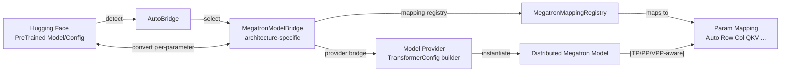
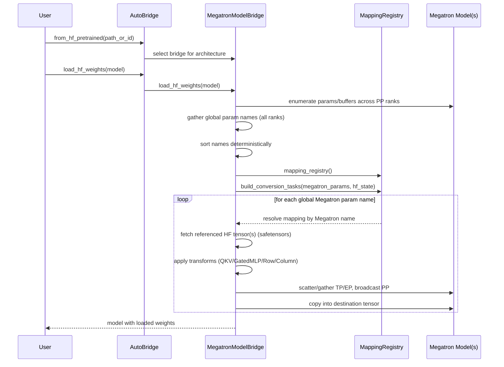
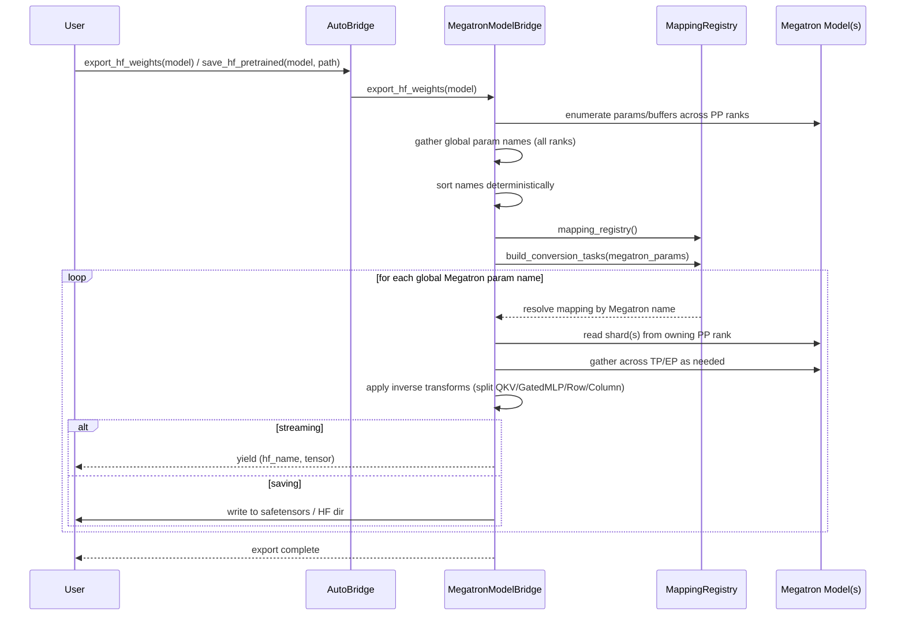

# Megatron Bridge — Technical Details of Conversion

Megatron Bridge provides a robust, parallelism-aware pathway to convert models and checkpoints between 🤗 Hugging Face Transformers and Megatron-Core formats. This page dives into the architecture, data flows, and per-parameter conversion engine, with examples.

Megatron Bridge performs on-the-fly, model-parallel-aware, per-parameter conversion—unlike traditional converters that require a single GPU and full in-memory loading of both Megatron-Core and HF models.

- For API-centric usage, see the guide: [Bridge with 🤗 Hugging Face](./bridge-guide.md)
- For component overview and mapping patterns, see: `src/megatron/bridge/models/README.md`

## Architecture at a glance



Key components:

- AutoBridge: Detects HF architecture, constructs the appropriate bridge, exposes high-level convert/save APIs. See [auto_bridge.py](https://github.com/NVIDIA-NeMo/Megatron-Bridge/tree/main/src/megatron/bridge/models/conversion/auto_bridge.py).
- MegatronModelBridge: Orchestrates conversion, builds conversion tasks, handles per-parameter streaming. See [model_bridge.py](https://github.com/NVIDIA-NeMo/Megatron-Bridge/tree/main/src/megatron/bridge/models/conversion/model_bridge.py).
- MegatronMappingRegistry: Registry of parameter-name mappings; resolves concrete `MegatronParamMapping` for each weight. See [mapping_registry.py](https://github.com/NVIDIA-NeMo/Megatron-Bridge/tree/main/src/megatron/bridge/models/conversion/mapping_registry.py).
- Param Mappings: Implement parameter transformations and parallel distribution (Auto, ColumnParallel, RowParallel, QKV, GatedMLP, Replicated, custom). See [param_mapping.py](https://github.com/NVIDIA-NeMo/Megatron-Bridge/tree/main/src/megatron/bridge/models/conversion/param_mapping.py).
- Model Providers: Build `TransformerConfig`-compatible providers for Megatron-Core and instantiate distributed models. See [models/](https://github.com/NVIDIA-NeMo/Megatron-Bridge/tree/main/src/megatron/bridge/models).
- Specific model bridge definitions: Architecture-specific bridges live under their model folders, for example [LlamaBridge](https://github.com/NVIDIA-NeMo/Megatron-Bridge/tree/main/src/megatron/bridge/models/llama/llama_bridge.py) and [Qwen3Bridge](https://github.com/NVIDIA-NeMo/Megatron-Bridge/tree/main/src/megatron/bridge/models/qwen/qwen3_bridge.py).

## Conversion workflow

The conversion engine is powered by two pieces: the architecture-specific Megatron model bridge and the parameter mappings.

(1) Config mapping + model creation: You specify a config mapping and parameter mapping strategy (name patterns + mapping types). The bridge loads the HF config, translates it into a Megatron provider, and the provider instantiates a (possibly distributed) Megatron model. With TP/PP/EP enabled, each rank holds only a shard of the model.

```python
from megatron.bridge import AutoBridge

# Build bridge and instantiate Megatron model(s)
bridge = AutoBridge.from_hf_pretrained("meta-llama/Llama-3.2-1B")
provider = bridge.to_megatron_provider()
megatron_model = provider.provide_distributed_model(wrap_with_ddp=False)
```

(2) Gather all params: After the model is created, the bridge enumerates all named parameters and buffers across PP ranks. It then sorts them to produce a deterministic global order, ensuring every rank uses the same mapping order for collective operations during conversion.

(3) Resolve mappings: Using the global Megatron parameter names, the bridge queries the mapping registry to resolve a concrete mapping per parameter. For example, in Qwen3, `decoder.layers.0.self_attention.linear_qkv.weight` matches a `QKVMapping` pattern. Resolution always starts from the Megatron name; HF names are derived via wildcard substitution. Only the referenced HF tensors are fetched from safetensors—the full HF model is never fully loaded.

```python
from megatron.bridge.models.conversion.mapping_registry import MegatronMappingRegistry
from megatron.bridge.models.conversion.param_mapping import AutoMapping, QKVMapping

registry = MegatronMappingRegistry(
    AutoMapping(
        megatron_param="decoder.layers.*.mlp.linear_fc2.weight",
        hf_param="model.layers.*.mlp.down_proj.weight",
    ),
    QKVMapping(
        megatron_param="decoder.layers.*.self_attention.linear_qkv.weight",
        q="model.layers.*.self_attn.q_proj.weight",
        k="model.layers.*.self_attn.k_proj.weight",
        v="model.layers.*.self_attn.v_proj.weight",
    ),
)
# Example: "decoder.layers.0.self_attention.linear_qkv.weight" → QKVMapping
```

(4) Create conversion tasks: The bridge pairs every Megatron parameter with its resolved mapping and associated metadata (owning module, tensor handle, parallelism context). These per-parameter tasks become the unit of work for conversion.

(5) Execute conversions: For HF→Megatron or Megatron→HF, the bridge iterates tasks and calls the mapping’s `hf_to_megatron` or `megatron_to_hf` routines. Conversion streams parameter-by-parameter to minimize memory.

```python
# HF → Megatron streaming import (internally iterates conversion tasks)
bridge.load_hf_weights(megatron_model)
```

(6) Mapping semantics: Each mapping handles the necessary distribution logic—broadcasting across PP, scattering/gathering across TP/EP—and applies structural transforms (e.g., QKV fuse/split, gated-MLP concat/split, row/column parallel splits).

Properties:

- Per-parameter streaming: Only the weight currently being processed is kept in memory.
- Parallelism aware: Distribution respects TP (tensor), PP (pipeline), VPP (virtual pipeline), and expert parallel settings.
- Deterministic mapping: Names resolve via `MegatronMappingRegistry`, including wildcard support.

### HF → Megatron (import)



### Megatron → HF (export)



## Param mappings and parallelism

Mapping types available via `megatron.bridge.models.conversion.param_mapping`:

- AutoMapping: General purpose 1:1 name mapping with wildcard support.
- ColumnParallelMapping: Splits along output dimension (dim 0) for TP.
- RowParallelMapping: Splits along input dimension (dim 1) for TP.
- QKVMapping: Fuses/splits HF Q, K, V projections to Megatron QKV and vice-versa.
- GatedMLPMapping: Concatenates/splits gated MLP projections.
- ReplicatedMapping: Replicates parameters across ranks (e.g., LayerNorm).

Shape intuition under TP of size `N`:

```python
# Column-parallel (output split)
# [out_dim, in_dim] -> [out_dim/N, in_dim] per rank

# Row-parallel (input split)
# [out_dim, in_dim] -> [out_dim, in_dim/N] per rank

# Replicated
# [d] -> [d] on all ranks
```

## Architecture-specific bridge example: Qwen3

Path: `src/megatron/bridge/models/qwen/qwen3_bridge.py`

```python
from megatron.core.models.gpt.gpt_model import GPTModel
from transformers import Qwen3ForCausalLM
from megatron.bridge.models.conversion.model_bridge import MegatronModelBridge
from megatron.bridge.models.conversion.mapping_registry import MegatronMappingRegistry
from megatron.bridge.models.conversion.param_mapping import AutoMapping, QKVMapping, GatedMLPMapping
from megatron.bridge.models.hf_pretrained.causal_lm import PreTrainedCausalLM
from megatron.bridge.models.qwen.qwen_provider import Qwen3ModelProvider

@MegatronModelBridge.register_bridge(source=Qwen3ForCausalLM, target=GPTModel)
class Qwen3Bridge(MegatronModelBridge):
    def provider_bridge(self, hf_pretrained: PreTrainedCausalLM) -> Qwen3ModelProvider:
        cfg = hf_pretrained.config
        return Qwen3ModelProvider(
            num_layers=cfg.num_hidden_layers,
            hidden_size=cfg.hidden_size,
            ffn_hidden_size=cfg.intermediate_size,
            num_attention_heads=cfg.num_attention_heads,
            num_query_groups=cfg.num_key_value_heads,
            init_method_std=cfg.initializer_range,
            layernorm_epsilon=cfg.rms_norm_eps,
            gated_linear_unit=True,
            make_vocab_size_divisible_by=self.make_vocab_size_divisible_by(cfg.vocab_size),
            rotary_base=cfg.rope_theta,
            share_embeddings_and_output_weights=getattr(cfg, "tie_word_embeddings", False),
            vocab_size=cfg.vocab_size,
            seq_length=cfg.max_position_embeddings,
            fp16=(self.dtype_from_hf(cfg) == torch.float16),
            bf16=(self.dtype_from_hf(cfg) == torch.bfloat16),
            params_dtype=self.dtype_from_hf(cfg, default=torch.float32),
            generation_config=hf_pretrained.generation_config,
            qk_layernorm=True,
        )

    def mapping_registry(self) -> MegatronMappingRegistry:
        mappings = [
            AutoMapping(
                megatron_param="embedding.word_embeddings.weight",
                hf_param="model.embed_tokens.weight",
            ),
            AutoMapping(
                megatron_param="output_layer.weight",
                hf_param="lm_head.weight",
            ),
            AutoMapping(
                megatron_param="decoder.final_layernorm.weight",
                hf_param="model.norm.weight",
            ),
            AutoMapping(
                megatron_param="decoder.layers.*.self_attention.linear_qkv.layer_norm_weight",
                hf_param="model.layers.*.input_layernorm.weight",
            ),
            AutoMapping(
                megatron_param="decoder.layers.*.mlp.linear_fc2.weight",
                hf_param="model.layers.*.mlp.down_proj.weight",
            ),
            QKVMapping(
                megatron_param="decoder.layers.*.self_attention.linear_qkv.weight",
                q="model.layers.*.self_attn.q_proj.weight",
                k="model.layers.*.self_attn.k_proj.weight",
                v="model.layers.*.self_attn.v_proj.weight",
            ),
            GatedMLPMapping(
                megatron_param="decoder.layers.*.mlp.linear_fc1.weight",
                gate="model.layers.*.mlp.gate_proj.weight",
                up="model.layers.*.mlp.up_proj.weight",
            ),
        ]
        return MegatronMappingRegistry(*mappings)
```

Notes:

- `provider_bridge`: Translate HF config into a Megatron-compatible provider, including architecture quirks (e.g., `qk_layernorm=True`).
- `mapping_registry`: Define exact name patterns and transformation mappings. Wildcards `*` apply the same rule across layers.

## Code examples

### Load HF and convert to Megatron

```python
import torch
from megatron.bridge import AutoBridge

# Auto-detect architecture and prepare bridge
bridge = AutoBridge.from_hf_pretrained(
    "meta-llama/Llama-3.2-1B",
    torch_dtype=torch.bfloat16,
    trust_remote_code=True,
)

# Build provider and configure parallelism before instantiation
provider = bridge.to_megatron_provider()
provider.tensor_model_parallel_size = 1
provider.pipeline_model_parallel_size = 1

# Instantiate Megatron model(s)
megatron_model = provider.provide_distributed_model(wrap_with_ddp=False)

# Load weights HF -> Megatron (per-parameter streaming)
bridge.load_hf_weights(megatron_model)
```

### Export Megatron back to HF

```python
# Save complete HF model directory (config + tokenizer + safetensors)
bridge.save_hf_pretrained(megatron_model, "./exported-llama")

# Or save just the weights (safetensors)
bridge.save_hf_weights(megatron_model, "./weights", show_progress=False)

# Or stream tensors on-the-fly without saving to disk
for name, tensor in bridge.export_hf_weights(megatron_model, cpu=True):
    print(name, tuple(tensor.shape))
```

### Check support before loading

```python
from megatron.bridge import AutoBridge

if AutoBridge.can_handle("meta-llama/Llama-3.2-1B"):
    bridge = AutoBridge.from_hf_pretrained("meta-llama/Llama-3.2-1B")
else:
    raise RuntimeError("Model requires a custom bridge implementation")
```

### Skeleton for a custom bridge

```python
from megatron.bridge.models.conversion.model_bridge import MegatronModelBridge
from megatron.bridge.models.conversion.mapping_registry import MegatronMappingRegistry
from megatron.bridge.models.conversion.param_mapping import AutoMapping, QKVMapping

# Example: LlamaForCausalLM -> GPTModel
@MegatronModelBridge.register_bridge(source="LlamaForCausalLM", target="GPTModel")
class MyLlamaBridge(MegatronModelBridge):
    def provider_bridge(self, hf_pretrained):
        cfg = hf_pretrained.config
        # Return a ModelProvider configured from HF config
        return MyLlamaProvider(
            num_layers=cfg.num_hidden_layers,
            hidden_size=cfg.hidden_size,
            num_attention_heads=cfg.num_attention_heads,
            # ... additional fields ...
        )

    def mapping_registry(self) -> MegatronMappingRegistry:
        return MegatronMappingRegistry(
            # Direct 1:1 mapping
            AutoMapping(
                megatron_param="embedding.word_embeddings.weight",
                hf_param="model.embed_tokens.weight",
            ),
            # QKV packed in Megatron vs. separate in HF
            QKVMapping(
                q="model.layers.*.self_attn.q_proj.weight",
                k="model.layers.*.self_attn.k_proj.weight",
                v="model.layers.*.self_attn.v_proj.weight",
                megatron_param="decoder.layers.*.self_attention.linear_qkv.weight",
            ),
            # ... add Row/ColumnParallel, GatedMLP, etc. as needed ...
        )
```

Tips:

- Use wildcard `*` in names to map per-layer parameters.
- Keep dimensions consistent with the chosen parallelism strategy.
- Add architecture quirks (e.g., RoPE scaling, layer norms) in `provider_bridge`.

## Memory and streaming characteristics

- Safetensors-backed state sources allow random-access by key, enabling per-parameter streaming.
- The bridge iterates Megatron parameter order, querying HF state as needed, never materializing the full HF model in memory.
- On export, weights can be streamed to a generator, to safetensors, or to a full HF directory.

## Cross-links and references

- User guide: [Bridge with 🤗 Hugging Face](./bridge-guide.md)
- Component reference and patterns: `src/megatron/bridge/models/README.md`
- Core orchestrator: `src/megatron/bridge/models/conversion/model_bridge.py`
- Auto selection: `src/megatron/bridge/models/conversion/auto_bridge.py`
- Param mappings: `src/megatron/bridge/models/conversion/param_mapping.py`
- Example scripts: `examples/models/generate_from_hf.py`
