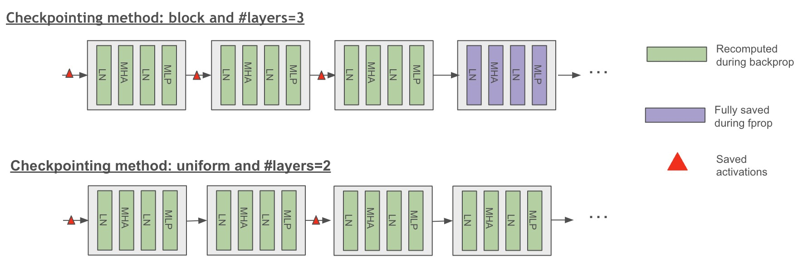
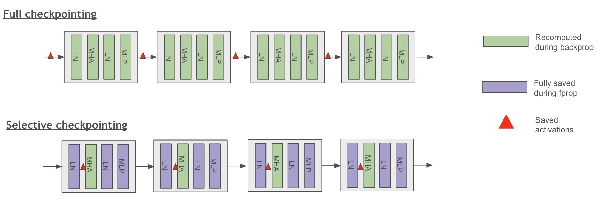

# Activation Recomputation

The input activations of network layers are stored in device memory and are used to compute gradients during back-propagation. When training a LLM with a long sequence length or a large micro-batch size, these input activations can quickly saturate device memory. Checkpointing a few activations and recomputing the rest is a common technique to reduce device memory usage.

Activation recomputation in Megatron Bridge is configured through the model provider's recomputation parameters, which are based on Megatron Core's `TransformerConfig`.

## Transformer Layer Recomputation

Megatron Bridge supports transformer layer recomputation, which checkpoints the input of each transformer layer and recomputes the activations for the remaining layers. This technique significantly reduces activation memory usage. However, it increases the per-transformer layer computation cost by 30% due to re-executing the entire layer's forward computation.

Megatron Bridge also supports partial transformer layer recomputation, which is beneficial when recomputing a few transformer layers helps to reduce enough GPU memory for the model to fit. This approach avoids the need to recompute the rest of the layers.

### Configuration

Transformer layer recomputation is configured through the model provider's recomputation parameters:

```python
from megatron.bridge.models import GPTModelProvider

# Full recomputation - recompute all layers
model_config = GPTModelProvider(
    recompute_granularity="full",  # Enable full layer recomputation
    recompute_method="uniform",    # Uniform distribution across layers
    recompute_num_layers=4,        # Number of layers per recomputation block
    # ... other model parameters
)
```

### Recomputation Methods

#### Block Method
Recomputes a specific number of transformer layers per pipeline stage:

```python
model_config = GPTModelProvider(
    recompute_granularity="full",
    recompute_method="block",      # Block-wise recomputation
    recompute_num_layers=4,        # Recompute 4 layers per pipeline stage
)
```

#### Uniform Method
Uniformly divides the total number of transformer layers and recomputes input activations for each divided chunk:

```python
model_config = GPTModelProvider(
    recompute_granularity="full",
    recompute_method="uniform",    # Uniform distribution
    recompute_num_layers=8,        # Number of layers per recomputation block
)
```

### Pipeline Parallelism Considerations

When training with pipeline parallelism:
- `recompute_num_layers` indicates the layers per pipeline stage
- When using virtual pipelining, `recompute_num_layers` specifies the number of layers per virtual pipeline stage
- The framework automatically handles recomputation coordination across pipeline stages


*Figure 1: Scheme of uniform and block checkpointing method (full checkpointing granularity)*

## Self-attention Recomputation

Megatron Bridge supports selective self-attention recomputation that checkpoints the inputs of each self-attention block and recomputes the intermediate input activations. This cost-efficient method achieves high memory savings with minimal recomputation cost.

The intermediate layers of the self-attention block account for the majority of the activation memory because the input sizes of softmax, dropout, and QKV dot-product attention layers have memory complexity proportional to the sequence length squared. However, their recomputation cost is relatively smaller than other linear projection layers that scale with the hidden size squared.


*Figure 2: Scheme of full and selective checkpointing granularity*

### Configuration

Self-attention recomputation is enabled using selective granularity:

```python
from megatron.bridge.models import GPTModelProvider

model_config = GPTModelProvider(
    recompute_granularity="selective",  # Enable selective recomputation
    recompute_modules=["core_attn"],    # Recompute attention modules (default)
    # ... other model parameters
)
```

### Recomputation Modules

Megatron Bridge supports selective recomputation for various modules:

```python
model_config = GPTModelProvider(
    recompute_granularity="selective",
    recompute_modules=[
        "core_attn",      # Core attention computation (default)
        "mlp",            # MLP layers
        "layernorm",      # Layer normalization
        "moe",            # Mixture of Experts layers
        "moe_act",        # MoE activation functions
        "shared_experts", # Shared expert layers
        "mla_up_proj",    # Multi-Latent Attention up projection
    ],
)
```

### Flash Attention Integration

Self-attention recomputation is automatically enabled when using Flash Attention through Transformer Engine. Flash Attention inherently provides memory efficiency by recomputing attention scores rather than storing them, making additional explicit recomputation often unnecessary.

## Advanced Recomputation Configuration

### Distributed Activation Checkpointing

For models using model parallelism, you can distribute saved activations across the model parallel group:

```python
model_config = GPTModelProvider(
    recompute_granularity="selective",
    distribute_saved_activations=True,  # Distribute across model parallel group
    # Note: Cannot be used with sequence_parallel=True
)
```

### Memory vs Computation Trade-offs

Different recomputation strategies offer different memory-computation trade-offs:

- **Selective recomputation**: Provides high memory savings with minimal recomputation cost by targeting memory-intensive operations like attention
- **Full recomputation**: Significantly reduces activation memory usage but increases per-transformer layer computation cost by approximately 30%
- **No recomputation**: Preserves all activations in memory, requiring more GPU memory but no additional computation

### MoE-Specific Recomputation

For Mixture of Experts models, specialized recomputation options are available:

```python
model_config = GPTModelProvider(
    # MoE configuration
    num_moe_experts=8,
    expert_model_parallel_size=2,
    
    # MoE recomputation
    recompute_granularity="selective",
    recompute_modules=["moe", "moe_act"],  # Recompute MoE-specific modules
)
```
